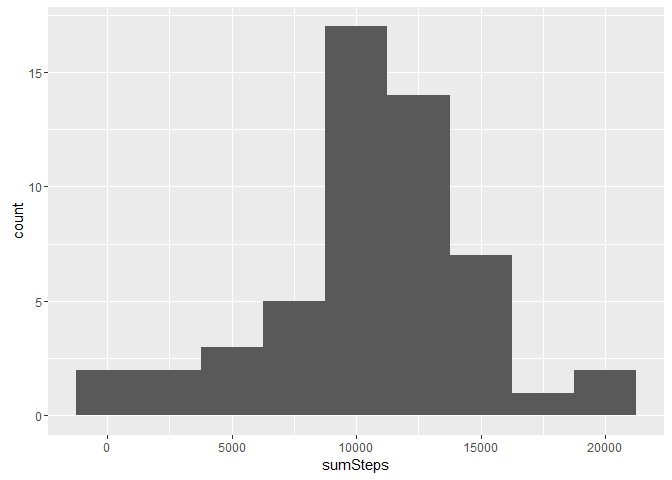
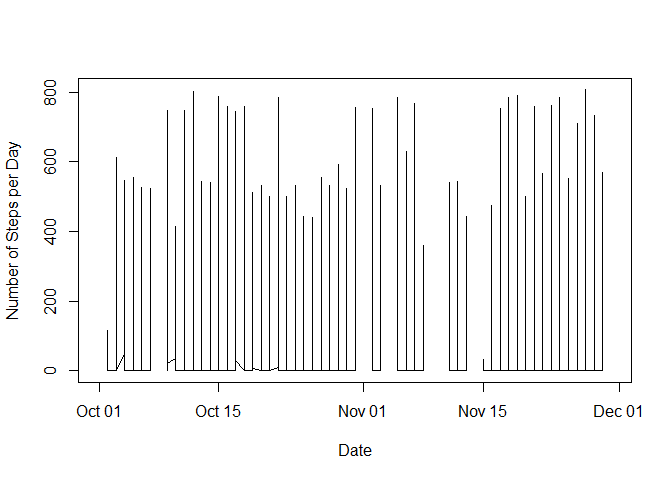

# Reproducible Research: Peer Assessment 1


## Loading and preprocessing the data

```r
library(tidyr)
library(dplyr)
```

```
## 
## Attaching package: 'dplyr'
```

```
## The following objects are masked from 'package:stats':
## 
##     filter, lag
```

```
## The following objects are masked from 'package:base':
## 
##     intersect, setdiff, setequal, union
```

```r
act <- read.csv("C:/Scratch/RepData_PeerAssessment1/activity/activity.csv")
dA <- tbl_df(act)

as.Date(as.character(dA$date), "%Y-%m-%d") -> dA$dDate
dates <- levels(dA$date)
nDays <- length(dates)

group_by(dA, dDate) -> gdA
summarize(gdA, sumSteps = sum(steps))
```

```
## Source: local data frame [61 x 2]
## 
##         dDate sumSteps
##        (date)    (int)
## 1  2012-10-01       NA
## 2  2012-10-02      126
## 3  2012-10-03    11352
## 4  2012-10-04    12116
## 5  2012-10-05    13294
## 6  2012-10-06    15420
## 7  2012-10-07    11015
## 8  2012-10-08       NA
## 9  2012-10-09    12811
## 10 2012-10-10     9900
## ..        ...      ...
```

```r
summarize(gdA, sumSteps = sum(steps)) -> sumSteps
```

## What is mean total number of steps taken per day?


Let us address the two questions presented:  first, what is the number of total steps taken each day?

```r
library(ggplot2)
ggplot(data= sumSteps, aes(sumSteps), title = "Number of Steps", xlab = "sum of steps") -> g
g + geom_histogram(binwidth = 2500) -> g
print(g)
```

```
## Warning: Removed 8 rows containing non-finite values (stat_bin).
```

<!-- -->
Secondly, what are the mean and median number of steps taken per day, excluding NA days?

```r
mean(sumSteps$sumSteps, na.rm = TRUE) -> meanSteps
median(sumSteps$sumSteps, na.rm = TRUE) -> medSteps
print(paste("Mean Steps:", meanSteps))
```

```
## [1] "Mean Steps: 10766.1886792453"
```

```r
print(paste("Median Steps:", medSteps))
```

```
## [1] "Median Steps: 10765"
```
## What is the average daily activity pattern?
Now, determine the character of the daily activity pattern.  A time-series might help:

```r
plot(gdA$dDate,gdA$steps, type = "l", xlab = "Date", ylab = "Number of Steps per Day")
```

<!-- -->
OK - now let's calculate the daily patterns.

```r
idA <- group_by(dA, interval)
summarize(idA, avgSteps = mean(steps, na.rm= TRUE)) -> summaryIDA
which.max(summaryIDA$avgSteps)
```

```
## [1] 104
```

```r
summaryIDA[104,]
```

```
## Source: local data frame [1 x 2]
## 
##   interval avgSteps
##      (int)    (dbl)
## 1      835 206.1698
```
## Imputing missing values
First, let's fill in those NA with the mean number of steps.

```r
sum(is.na(dA$steps)) -> naRows

print(paste("   Total number of NA rows is", naRows))
```

```
## [1] "   Total number of NA rows is 2304"
```

```r
summary(idA)[4] -> meanSteps

ifelse(is.na(idA$steps),37.38,idA$steps ) -> idA$filledSteps
fidA <- idA
```
yep, fidA, that's our new data frame.

```r
group_by(fidA, dDate) -> gfidA
summarize(gfidA, sumSteps = sum(steps)) -> filledSumSteps
ggplot(data= filledSumSteps, aes(sumSteps), title = "Number of Steps", xlab = "sum of steps") -> g
g + geom_histogram(binwidth = 2500) -> g
print(g)
```

```
## Warning: Removed 8 rows containing non-finite values (stat_bin).
```

<!-- -->

```r
mean(filledSumSteps$sumSteps, na.rm = TRUE) -> meanFSteps
median(filledSumSteps$sumSteps, na.rm = TRUE) -> medFSteps
print(paste("Mean Filled Steps:", meanFSteps))
```

```
## [1] "Mean Filled Steps: 10766.1886792453"
```

```r
print(paste("Median Filled Steps:", medFSteps))
```

```
## [1] "Median Filled Steps: 10765"
```

## Are there differences in activity patterns between weekdays and weekends?
